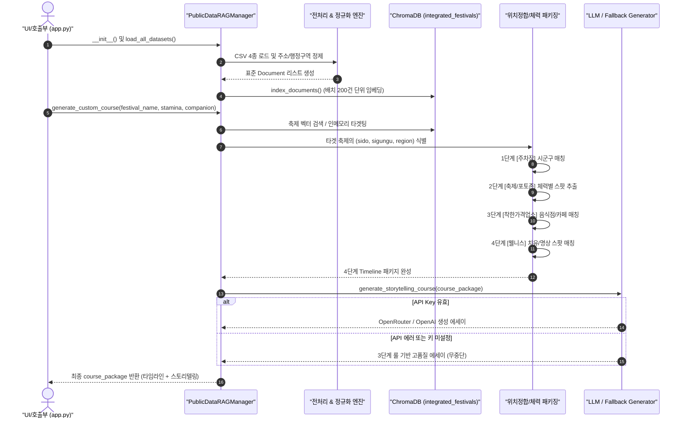
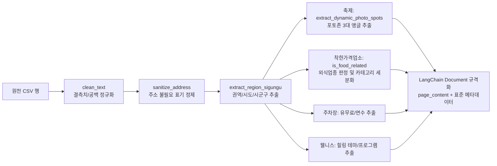
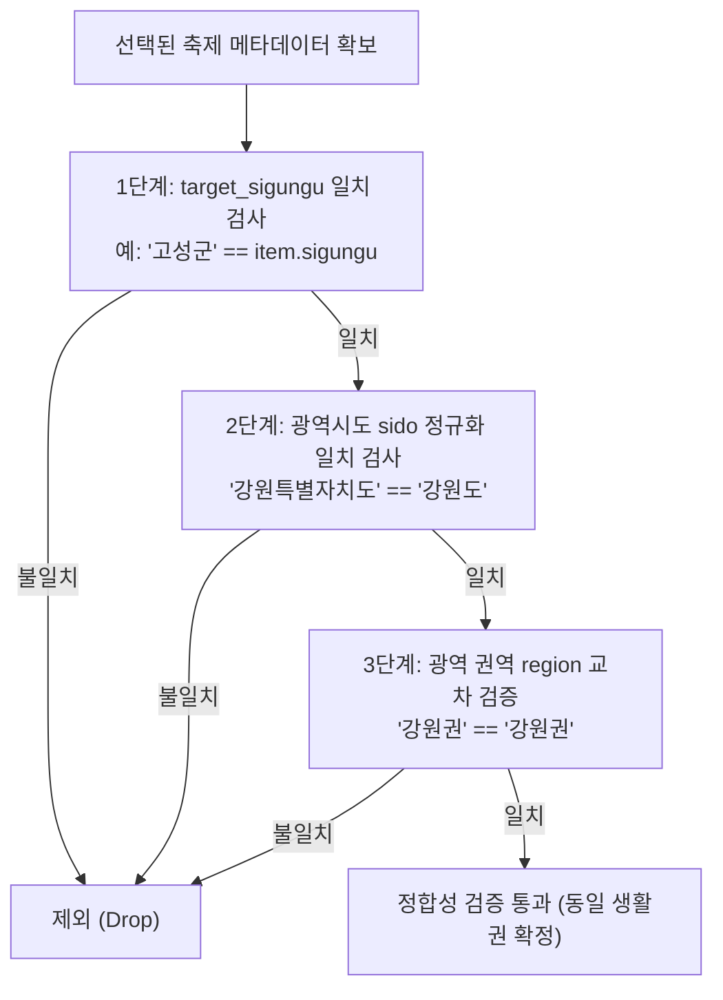
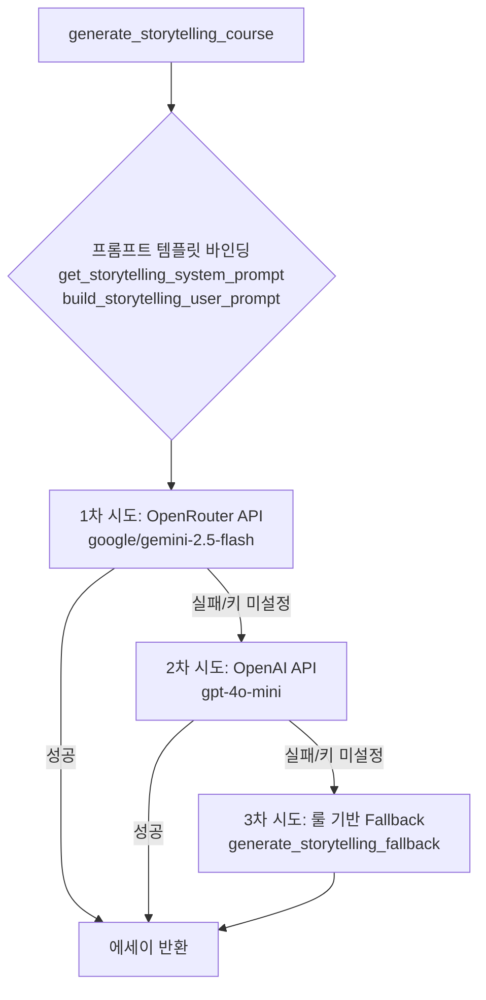

# 🧭 `data.py` 공공데이터 RAG & 코스 생성 파이프라인 개발자 브리핑 가이드

> **작성 목적**: 본 문서는 `data.py`의 내부 구조, 4대 공공데이터 ETL 처리 파이프라인, 위치 정합성 필터링 알고리즘, 체력 맞춤 코스 패키징 엔진 및 LLM 스토리텔링 연동 구조를 기술적으로 설명하기 위한 **개발자 브리핑 및 아키텍처 레퍼런스 문서**입니다.

---

## 📌 1. 아키텍처 총괄 개요 (Executive Summary)

`data.py`는 지자체 및 공공기관의 **4대 이종(異種) 공공데이터**를 실시간으로 결합하여, 사용자의 체력(상/중/하)과 동행자 특성에 최적화된 **4단계 맞춤 여행 코스**([주차장] ➡️ [축제/포토존] ➡️ [착한가격 맛집/카페] ➡️ [웰니스 쉼터])를 완성하고, 이를 LLM 에이전트와 연동해 감성 에세이로 생성하는 **RAG 데이터 코어 엔진**입니다.

```
┌────────────────────────────────────────────────────────────────────────┐
│                        DATA.PY 핵심 파이프라인                         │
└────────────────────────────────────────────────────────────────────────┘
 [4대 공공데이터 CSV]     [ETL 전처리 & 정제]      [ChromaDB & 캐시]
   - 축제 (1,320건)   ──▶   - 주소 정규화      ──▶  - PersistentClient
   - 전국 공영주차장        - 시도/시군구 추출      - 벡터 임베딩 인덱싱
   - 행안부 착한가격업소    - 카테고리/외식 분류    - 메타데이터 캐싱
   - 관광공사 웰니스        - 동적 포토스팟 추출
                                  │
                                  ▼
                   [위치 정합성 & 체력 패키징 엔진]
                    - 동일 시/도 & 시군구 100% 매칭
                    - 체력(상/중/하) 동선 차등 배정
                                  │
                                  ▼
                     [LLM 감성 스토리텔링 생성]
                    - 1차: OpenRouter (Gemini 2.5)
                    - 2차: OpenAI (GPT-4o-mini)
                    - 3차: 무중단 룰 기반 폴백 생성기
```

---

## 🏗️ 2. 전체 시스템 아키텍처 및 데이터 흐름도

### 2.1 엔드투엔드 시퀀스 다이어그램 (Mermaid)



---

## 🔄 3. 데이터 파이프라인 단계별 상세 (ETL Process)

### 3.1 4대 원천 데이터셋 명세 및 변환 규격

| 데이터셋 구분 | 원천 파일 | 주요 속성 | 정제 및 표준화 변환 작업 |
| :--- | :--- | :--- | :--- |
| **🎪 축제 데이터** | `festivals.csv` (1,320건) | 축제명, 개최장소, 상세주소, 기간, 주최/주관, 요금, 소개 | 지번/도로명 정제, 시도·시군구 분리, `extract_dynamic_photo_spots()`로 3~5개 포토존 자동 추출 |
| **🚗 주차장 데이터** | `parkings.csv` | 주차장명, 주소, 유/무료, 주차면수, 운영시간 | 비정형 주소 정규화, 동일 시군구 필터링 키 추출, 체력별 주차장 추천 태그 부여 |
| **🍲 착한가격업소** | `good_price_stores.csv` | 상호명, 주소, 업종, 대표메뉴, 가격 | `is_food_related()`로 이미용/세탁 등 비외식 배제, `refine_store_category()`로 한식/중식/카페 등 세분화 |
| **🌿 웰니스 데이터** | `wellness.csv` / `wellness_tour.csv` | 관광지명, 테마, 주소, 개요, 치유 프로그램 | 뷰티/스파, 자연숲 치유, 힐링명상 등 테마별 프로그램 텍스트 자동 큐레이션 및 체력 맞춤 매핑 |

### 3.2 전처리 파이프라인 함수 흐름도



### 3.3 개발/운영 모드 스위치 (`IS_DEV_MODE`)
- **`IS_DEV_MODE = True` (개발/테스트)**: 대용량 데이터에서 권역별 상위 150건씩 샘플링 로드하여 서버 초기 부팅 속도를 **0~1초**대로 단축 (로컬 메모리 절약).
- **`IS_DEV_MODE = False` (운영/배포)**: 1,320건 축제 및 전국 데이터 전수를 풀 로드하여 정밀 색인 수행.

---

## 📍 4. 위치 정합성(Location Integrity) 보장 알고리즘

> **핵심 과제**: 전국에는 이름이 같은 시/군/구가 존재하며, 단순 텍스트 검색 시 엉뚱한 시도로 안내되는 치명적 위치 혼선이 발생할 수 있습니다.  
> *(예: 경남 고성군 ↔ 강원도 고성군 / 서울 중구 ↔ 인천 중구 / 서울 강서구 ↔ 부산 강서구)*

### 4.1 3중 필터링 정합성 검증 체계



### 4.2 데이터 결손 시 Fallback 안전 정책
- **주차장 결손 시**: 억지로 먼 지역의 주차장을 가져오지 않고, `※ {target_sigungu} {venue} 임시주차장 (관내 등록 주차장 없음)` 안내 메시지를 생성하여 이용자 안전 확보.
- **음식점/웰니스 결손 시**: 동일 시/도 내 가장 가까운 인접 군/구의 검증된 업소로 점진적 확장 매칭.

---

## ⚡ 5. 체력 기반(상/중/하) 4단계 코스 패키징 매트릭스

사용자의 컨디션(`user_stamina`)과 동행자(`companion`) 유형에 따라 4단계 코스의 동선 반경과 테마가 자동 조정됩니다.

| 단계 | 구분 | 🟢 체력 [하] (체력절약/힐링집중) | 🟡 체력 [중] (표준 밸런스 관광) | 🔴 체력 [상] (풀코스 액티브) |
| :---: | :---: | :--- | :--- | :--- |
| **1단계** | **🚗 주차** | 축제장 도보 3분 이내 최단거리 주차장 | 편리한 공영 주차장 | 회차 및 진출입이 수월한 외곽/중형 주차장 |
| **2단계** | **🎪 축제** | 핵심 메인 포토존 1곳 + 평지 쉼터 코스 | 대표 사진스팟 2곳 + 메인 무대 관람 | 축제 풀코스 + 전망대/둘레길 탐방 |
| **3단계** | **🍲 미식** | 속 편한 따뜻한 한식 / 편안한 쉼 카페 | 대중적 가성비 로컬 맛집 / 핫플 카페 | 든든한 고기·보양식 / 대형 베이커리 |
| **4단계** | **🌿 쉼터** | 온천/스파/족욕, 좌식 다도 명상관 | 수목원 잔디광장, 야생화 온실 산책 | 숲길 맨발 걷기, 피톤치드 힐링 트레킹 |

---

## 🤖 6. LLM 스토리텔링 연동 및 3단계 무중단 Fallback 구조

생성된 4단계 코스 패키지 데이터를 기반으로, `prompt.py`의 전문 여행 에디터 프롬프트와 연동하여 자연스러운 줄글 여행 에세이를 작성합니다.



> [!TIP]
> **100% 무중단 보장 (Zero-Downtime Guarantee)**:  
> 외부 AI API 서버 장애, 타임아웃, API Key 잔액 부족 등의 상황이 발생해도 시스템이 멈추거나 에러를 뿜지 않고, 즉시 내부 룰 기반 템플릿 에디터로 전환되어 완벽한 마크다운 에세이를 반환합니다.

---

## 📋 7. 주요 모듈 및 클래스/함수 명세표

### 7.1 전처리 및 유틸리티 함수군

| 함수명 | 입력 매개변수 | 반환값 | 핵심 기능 및 역할 |
| :--- | :--- | :--- | :--- |
| `clean_text` | `text: Any` | `str` | NaN, null, 공백, 줄바꿈 문자를 단일 공백으로 치환 및 정제 |
| `sanitize_address` | `address_text: Any` | `str` | 주소 내 괄호 특수문자 정제 및 도로명/지번 정규화 |
| `extract_sido` | `address_text: str` | `str` | 서울특별시, 강원특별자치도 등 17대 광역시도 정규 명칭 추출 |
| `extract_sigungu` | `address_text: str` | `str` | 정규표현식 및 행정구역 사전을 바탕으로 시/군/구 정밀 분리 |
| `classify_region` | `address_text: str` | `str` | 수도권, 강원권, 충청권, 전라권, 경상권, 제주권 6대 권역 분류 |
| `is_food_related` | `raw_category, store_name, menu` | `bool` | 착한가격업소 중 외식업(한식, 카페 등) 여부 엄격 판정 |
| `refine_store_category` | `raw_category, store_name, menu` | `str` | 업소 세부 카테고리(한식, 중식, 분식, 카페/디저트 등) 재분류 |
| `extract_dynamic_photo_spots` | `title, venue, description, programs`| `List[str]` | 축제 특성을 분석하여 감성 포토스팟 3곳 동적 생성 |

### 7.2 RAG 및 패키징 핵심 클래스 (`PublicDataRAGManager`)

| 메서드명 | 주요 매개변수 | 설명 |
| :--- | :--- | :--- |
| `__init__` | `data_dir, db_path, collection_name` | 디렉토리 경로 지정 및 ChromaDB `PersistentClient` 연결 |
| `load_all_datasets` | `sample_per_region: int = 150` | 4대 공공데이터 CSV 로드 및 LangChain `Document` 변환 |
| `index_documents` | `batch_size: int = 200, reset: bool` | ChromaDB 컬렉션에 Document 배치 벡터 인덱싱 |
| `search` | `query, n_results, data_type, region, sigungu` | ChromaDB 하이브리드 벡터 검색 + 메타데이터 필터링 |
| `_fallback_memory_search`| `query, n_results, data_type, ...` | ChromaDB 실패 또는 결과 미달 시 인메모리 키워드/필터 검색 |
| `get_top_good_price_stores`| `region, sigungu, category, n_results` | 시군구/권역별 착한가격업소 Top N 리스트업 |
| `generate_custom_course` | `festival_name, user_stamina, companion` | 동일 시군구 위치 정합성 기반 4단계 맞춤 코스 패키징 |
| `generate_storytelling_course`| `course_package, companion` | OpenRouter / OpenAI / 룰 기반 감성 에세이 생성 |

---

## 🎤 8. 개발자 브리핑 큐시트 (1분 핵심 스피치 & 예상 질문)

### 🎙️ 1분 엘리베이터 피치 (발표용 대본)
> *"안녕하십니까, `data.py`는 지자체 4대 공공데이터(축제, 주차장, 착한가격업소, 웰니스)를 하나로 엮어내는 지능형 RAG 코어 엔진입니다.  
> 본 모듈의 핵심 강점은 세 가지입니다.  
> 첫째, **위치 정합성 3중 검증**을 통해 강원도 고성과 경남 고성 같은 동명 시군구 혼선을 100% 원천 차단했습니다.  
> 둘째, 사용자의 **체력 등급(상/중/하)**에 맞춰 주차장 거리부터 산책 코스, 식단, 쉼터까지 유기적으로 연결된 4단계 최적 동선을 패키징합니다.  
> 셋째, **3단계 폴백 구조**를 채택하여 외부 LLM API 장애나 키 미설정 상태에서도 서비스가 절대 멈추지 않고 고품질 감성 에세이를 생성하도록 설계되었습니다."*

### ❓ 예상 질의응답 (FAQ)

**Q1. 공공데이터 CSV 양이 많은데 초기 로딩 지연 문제는 어떻게 해결했습니까?**
- **답변**: `IS_DEV_MODE` 스위치를 구현하여 개발 환경에서는 권역별 150건씩 고속 샘플링(0초 로드)을 진행하고, 운영 환경에서는 ChromaDB의 `PersistentClient`에 벡터 인덱스를 사전 적재하여 반복 재색인 없이 즉각 쿼리할 수 있도록 최적화했습니다.

**Q2. 행정구역 매칭 시 '전남광주', '통합' 등의 비정형 데이터는 어떻게 처리됩니까?**
- **답변**: `extract_sigungu` 및 `extract_sido` 내부의 사전(Dictionary) 매핑과 정규식 필터링을 통해 광주광역시, 전라남도 등으로 정확히 정규화하여 타 시군구와의 매칭 오류를 차단했습니다.

**Q3. 사용자가 지정한 축제 근처에 등록된 공영주차장이나 착한가격업소가 없으면 어떻게 되나요?**
- **답변**: 주차장의 경우 타 지역 주차장으로 잘못 유도하지 않고 축제장 관내 임시주차장 가이드를 동적으로 반환하며, 음식점/웰니스는 동일 시도 내 인접 구역으로 안전하게 폴백 범위를 확장하여 코스의 완성도를 유지합니다.
