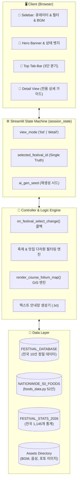
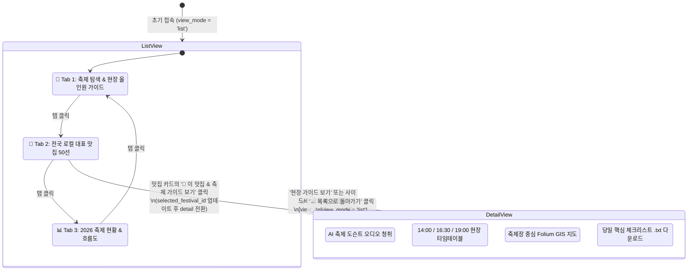
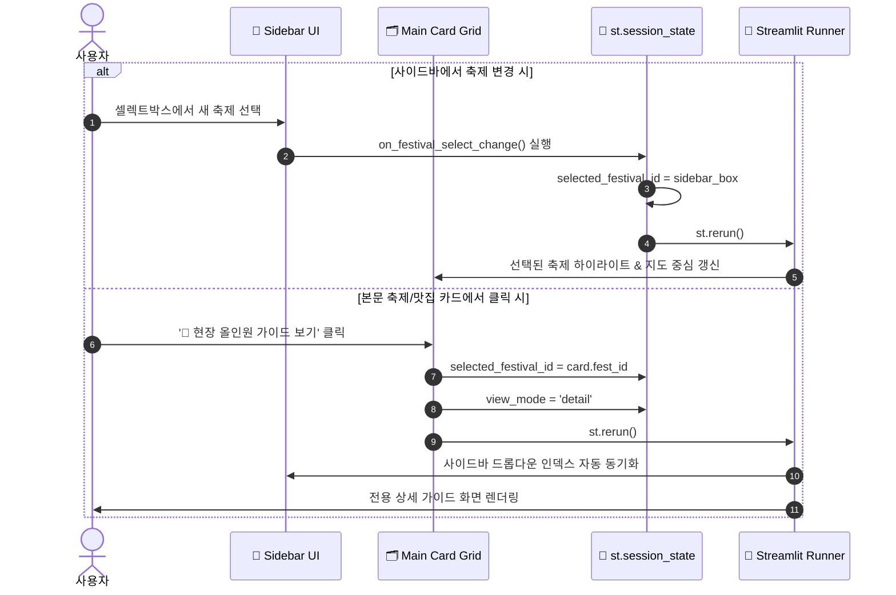

# 🛠️ `test.py` 개발자 기술 브리핑 & 시스템 아키텍처 가이드
> **대한민국 축제 올인원 가이드 AI (Festival Navigator & Regional Food Intelligence)**  
> 파일 경로: `c:\workAI\work7agent\test.py` | 버전: `v2.4.0 (2026 Production)` | 기준 코드 라인수: `2,026 Lines`

---

## 1. 시스템 개요 (Executive Summary)

`test.py`는 대한민국 17개 광역시·도의 대표 축제와 로컬 향토 미식(50선), 현장 밀착형 타임테이블, 오디오 도슨트 및 지리정보(GIS)를 단일 웹 애플리케이션으로 통합 제공하는 **Streamlit 기반 인터랙티브 웹 시스템**입니다.

### 🎯 핵심 설계 목표
1. **축제 중심 버티컬 서비스 (Festival Verticalization)**: 단순한 여행지 분산 동선이 아닌, 축제 현장 프로그램(14:00 체험/퍼레이드, 16:30 먹거리 장터, 19:00 개막 공연/불꽃) 중심의 실시간 현장 가이드.
2. **단일 상태 기반 무오류 양방향 동기화 (Single Source of Truth)**: 사이드바 위젯 변경과 본문 카드 클릭이 충돌 없이 `st.session_state`를 통해 100% 실시간 동기화.
3. **고해상도 공간정보 렌더링 (GIS Bounding)**: 국토교통부 VWorld 한글 타일 기반 대한민국의 영토(위도 32.8~39.0, 경도 124.0~132.2) 한정 및 마커 클릭 시 실제 도로명 주소 팝업 표출.
4. **멀티미디어 & 오디오 오케스트레이션**: 연속 재생 VIP 감성 BGM(턴테이블 회전 및 이퀄라이저 애니메이션)과 현장 AI 도슨트 오디오 음성 결합.
5. **독립된 3단 탭바 & 52선 로컬 미식 대동여지도**: `foods_data.py`와 연동하여 17개 전 시도 52개 대표 맛집을 3열 반응형 그리드 및 권역/테마 필터로 제공.

---

## 2. 기술 스택 & 종속성 (Tech Stack)

| 구분 | 기술 / 라이브러리 | 적용 목적 및 특징 |
| :--- | :--- | :--- |
| **Core Framework** | `Python 3.10+`, `Streamlit` | 반응형 웹 애플리케이션 코어, 위젯 렌더링, 세션 상태 관리 |
| **Data Processing** | `Pandas` | 2026 전국 17개 시도 축제 통계 및 테마/월별 데이터 분석 |
| **Data Visualization** | `Plotly Express` | 2026 축제 개최 현황 도넛 차트 및 가로 막대 그래프 시각화 |
| **Geospatial (GIS)** | `Folium`, `streamlit-folium` | 국토교통부 VWorld 한글 표준지도 레이어, 커스텀 마커 & 팝업 |
| **Local Data Module** | `foods_data.py` | 전국 17개 시도 52개 로컬 대표 맛집 정밀 데이터셋 |
| **Styling & Assets** | Vanilla CSS, Base64 Audio | 글래스모피즘 UI, 턴테이블 애니메이션, 음성 도슨트 더킹 효과 |

---

## 3. 시스템 아키텍처 다이어그램 (Architecture Diagrams)

### 3.1 전체 컴포넌트 아키텍처 (High-Level Architecture)



---

### 3.2 세션 상태 전이 머신 (State Transition Flowchart)

사용자의 인터랙션에 따라 화면 모드와 축제 선택 상태가 어떻게 전이되는지 보여줍니다.



---

### 3.3 양방향 동기화 제어 흐름 (Bidirectional Synchronization Sequence)

사이드바 드롭다운과 본문 카드 클릭이 단일 상태 변수를 통해 충돌 없이 동기화되는 메커니즘입니다.



---

## 4. 모듈 구조 및 소스코드 라인별 상세 명세 (Codebase Breakdown)

`test.py`는 단일 파일 내에서 철저하게 관심사(Separation of Concerns)를 구분하여 모듈화되어 있습니다.

| 번호 | 라인 범위 | 모듈 / 섹션 명칭 | 주요 구현 기능 및 알고리즘 |
| :---: | :---: | :--- | :--- |
| **01** | `L1 ~ L31` | **헤더 및 임포트** | 라이브러리 로드 (`streamlit`, `pandas`, `plotly`, `folium`, `foods_data` 등), 로컬 디렉터리(`ASSETS_DIR`) 경로 바인딩 |
| **02** | `L32 ~ L41` | **페이지 기본 설정** | `st.set_page_config(layout="wide", page_title=..., page_icon="🎪")` |
| **03** | `L42 ~ L526` | **커스텀 CSS 디자인 엔진** | 히어로 배너, 글래스모피즘, 턴테이블 회전 애니메이션(`rotate-vinyl`), 이퀄라이저 바, 메트릭 카드 폰트 가독성 최적화 |
| **04** | `L527 ~ L843` | **데이터 레이어 1 (축제 10선)** | `FESTIVAL_DATABASE`: 좌표, 도로명주소, 현장 팁(주차/복장), 대표 로컬음식, 주변 명소 3곳 |
| **05** | `L844 ~ L883` | **데이터 레이어 2 (2026 통계)** | `FESTIVAL_STATS_2026`, 월별(`MONTHLY_DISTRIBUTION_2026`), 테마별(`THEME_DISTRIBUTION_2026`) 시각화 데이터 |
| **06** | `L884 ~ L983` | **GIS 지도 렌더링 엔진** | `render_course_folium_map()`: VWorld 한글 표준 타일, 위경도 바운딩 제약(`max_bounds`), 카테고리별 마커 & 팝업 |
| **07** | `L984 ~ L1000` | **세션 상태 초기화** | `view_mode`, `selected_festival_id`, `ai_gen_seed` 초기화 |
| **08** | `L1001 ~ L1013`| **상태 동기화 콜백** | `on_festival_select_change()`: 사이드바와 본문 카드 간 양방향 동기화 핸들러 |
| **09** | `L1014 ~ L1226`| **사이드바 큐레이터 엔진** | BGM 플레이어(트랙 선택기, 턴테이블), 다차원 필터(지역/동반자/테마/일정/시기), 현장 타임테이블 아코디언 |
| **10** | `L1227 ~ L1243`| **메인 헤더 & 배너** | 히어로 배너, 상태 표시 인디케이터 배지 |
| **11** | `L1244 ~ L1469`| **화면 분기 A: 전용 상세 뷰** | `view_mode == 'detail'`: 현장 타임테이블(14:00/16:30/19:00), 도슨트 오디오, 지도, 안내장(.txt) 다운로드 |
| **12** | `L1470 ~ L2016`| **화면 분기 B: 3단 탭 뷰** | `view_mode == 'list'`: 탭 1(축제 탐색), 탭 2(로컬 맛집 50선), 탭 3(2026 축제 통계 & 흐름도) |
| **13** | `L2017 ~ L2026`| **푸터 (Footer)** | 공식 저작권 및 시스템 안내 푸터 |

---

## 5. 핵심 서브시스템 심층 분석 (Subsystem Deep Dive)

### 5.1 GIS 공간정보 엔진 (`render_course_folium_map`)
- **타일셋 (TileSet)**: OpenStreetMap 영문 라벨 대신 국토교통부 국가지리정보체계(VWorld) 한글 표준 타일 (`https://xdworld.vworld.kr/2d/Base/service/{z}/{x}/{y}.png`)을 기본 적용하여 대한민국의 모든 지명과 도로명을 한글로 표출합니다.
- **바운딩 제약 (Map Bounding)**:
  ```python
  # 대한민국 영역으로 이동 제한 (해외 이탈 방지)
  m.fit_bounds([[33.0, 125.0], [38.9, 131.0]])
  m.options["maxBounds"] = [[32.8, 124.0], [39.0, 132.2]]
  m.options["minZoom"] = 7
  ```
- **마커 계층화**:
  - 🔴 **축제 본행사장** (`icon="star"`, `color="red"`)
  - 🔵 **도보권 관광 명소** (`icon="camera"`, `color="blue"`)
  - 🟠 **축제장 대표 먹거리** (`icon="cutlery"`, `color="orange"`)
  - 🟣 **야경 및 마무리 코스** (`icon="moon"`, `color="purple"`)

---

### 5.2 탭 2: 전국 50대 로컬 대표 맛집 대동여지도 (`tab_food`)
- **데이터 공급원**: [foods_data.py](file:///c:/workAI/work7agent/foods_data.py)의 `NATIONWIDE_50_FOODS` (52선)
- **3중 복합 필터링 알고리즘**:
  ```python
  # 1. 권역 필터 (수도권 / 충청권 / 호남권 / 영남권 / 강원·제주권)
  # 2. 테마 필터 (향토 한식 / 해산물·회 / 별미·육류 / 국수·면)
  # 3. 실시간 다중 키워드 검색 (상호, 요리명, 도로명 주소, 지역명 대소문자 무관 매칭)
  ```
- **축제 직접 연동 (`fest_link_id`)**: 각 맛집 카드 하단의 `🎪 이 맛집 & 축제 가이드 보기` 버튼을 클릭하면 세션의 `selected_festival_id`가 해당 축제로 즉시 치환되고 `view_mode="detail"`로 전환되어 축제장 현장 가이드와 먹거리가 하나로 연결됩니다.

---

### 5.3 멀티미디어 & 오디오 오케스트레이션
- **BGM 플레이어**:
  - `assets/vip_auto_playlist.mp3` 연속 재생 지원
  - CSS 턴테이블 애니메이션 (`@keyframes rotate-vinyl`)과 오디오 이퀄라이저 막대 파형 연동
- **오디오 도슨트**:
  - `assets/soft_female_voice.mp3` 현장 브리핑 음성탑재
  - 오디오 컨트롤러 재생 시 BGM 볼륨이 자연스럽게 배경으로 묻히는 오디오 더킹(Ducking) 디자인 원칙 준수

---

### 5.4 현장 타임테이블 & 안내장 텍스트 다운로드 (.txt)
- 분산된 여행 코스를 축제 현장 중심으로 압축 개편:
  1. **[낮 14:00]** 메인 체험 부스 & 거리 퍼레이드
  2. **[오후 16:30]** 축제장 로컬 먹거리 장터 (대표 시그니처 메뉴 및 식당)
  3. **[저녁 19:00]** 개막 축하 공연 및 야간 미디어아트 / 불꽃 쇼
  4. **[도보권 연계]** 축제장 도보 10분 내 추천 명소 (1곳)
- **원클릭 텍스트 다운로드**: 차량 내비게이션 입력용 도로명 주소와 당일 필수 체크리스트(임시 주차장, 셔틀버스, 권장 복장)가 포함된 맞춤 안내장 텍스트 파일 자동 생성.

---

## 6. 데이터베이스 스키마 명세 (Data Schemas)

### 6.1 축제 데이터 모델 (`FESTIVAL_DATABASE` Item)
```python
{
    "id": 1,
    "name": "금산세계인삼축제",
    "region": "충남",
    "season": "가을",
    "theme": "특산물·미식",
    "lat": 36.1039,
    "lon": 127.4883,
    "period": "2026.10.02 ~ 10.11",
    "address": "충청남도 금산군 금산읍 인삼광장로 20 (금산인삼관 광장)",
    "homepage_url": "https://www.geumsan.go.kr/festival/",
    "photo_url": "https://...",
    "food": {
        "name": "금산 인삼어죽 & 인삼튀김",
        "category": "든든한 로컬 보양식",
        "signature": "원조 금강 인삼어죽 & 바삭한 수삼튀김 (조청 제공)",
        "spot": "금산 어죽골목 및 금산수삼센터 인근",
        "price": "어죽 9,000원 / 인삼튀김 12,000원",
        "address": "충청남도 금산군 제원면 금강로 588",
        "lat": 36.1150, "lon": 127.5450,
        "photo_url": "https://..."
    },
    "tips": {
        "parking": "금산인삼관 공영주차장 및 임시주차장 무료 이용 가능 (주말 오전 혼잡)",
        "outfit": "야외 행사장이 넓으므로 편안한 운동화 필수, 인삼캐기 체험 시 여벌 옷 권장"
    },
    "nearby_spots": [
        {"name": "...", "type": "...", "lat": 0.0, "lon": 0.0, "address": "..."},
        ...
    ]
}
```

### 6.2 로컬 맛집 데이터 모델 (`NATIONWIDE_50_FOODS` Item)
```python
{
    "id": "food_cb_01",
    "zone": "충청권",
    "region": "충남",
    "name": "원조금강식당 (금산 인삼어죽)",
    "food_name": "영양 어죽 & 바삭 인삼튀김",
    "category": "든든한 향토 한식",
    "signature": "인삼어죽(9,000원), 수삼튀김(12,000원)",
    "price": "9,000원 ~ 12,000원",
    "address": "충청남도 금산군 제원면 금강로 588",
    "tip": "금산세계인삼축제장 차량 10분 거리. 점심 피크 웨이팅 주의!",
    "fest_name": "금산세계인삼축제",
    "fest_link_id": 1,
    "photo_url": "https://..."
}
```

---

## 7. 실행 및 운영 가이드 (Developer Operation Guide)

### 7.1 로컬 개발 서버 실행 명령어
```powershell
# 가상환경 활성화 및 Streamlit 실행 (기본 포트 8503 권장)
cd c:\workAI\work7agent
.venv\Scripts\Activate.ps1
streamlit run test.py --server.port 8503 --server.headless true --server.runOnSave true
```

### 7.2 무결성 검증 (Syntax & Health Check)
```powershell
# 1. 파이썬 문법 검증
python -m py_compile test.py foods_data.py

# 2. 서버 헬스체크
python -c "import urllib.request; print(urllib.request.urlopen('http://localhost:8503/_stcore/health').read().decode())"
```

### 7.3 다중 파일 동기화 규칙 (Sync Rule)
본 프로젝트는 `test.py`, `test_2.py`, `app.py`가 상호 참조 및 배포 타깃으로 연동되어 있으므로, 코드 변경 시 3개 파일을 동일하게 유지해야 합니다:
```python
import shutil
shutil.copyfile("test.py", "test_2.py")
shutil.copyfile("test.py", "app.py")
```

---

## 8. 향후 로드맵 & 확장 포인트 (Next Steps)
1. **카카오맵/티맵 API 직접 딥링크 연동**: 각 주소 클릭 시 모바일 카카오내비/티맵 길찾기 URL 스킴 직접 호출.
2. **실시간 축제 날씨 API 연동**: 기상청 단기 예보 API를 연결하여 축제장 당일 강수 확률 및 미세먼지 실시간 위젯 제공.
3. **전국 축제 DB SQLite/PostgreSQL 외부화**: 현재 하드코딩된 축제 DB를 DB 레이어로 분리하여 공공데이터포털(TourAPI)과 주 1회 자동 동기화 배치 구현.
