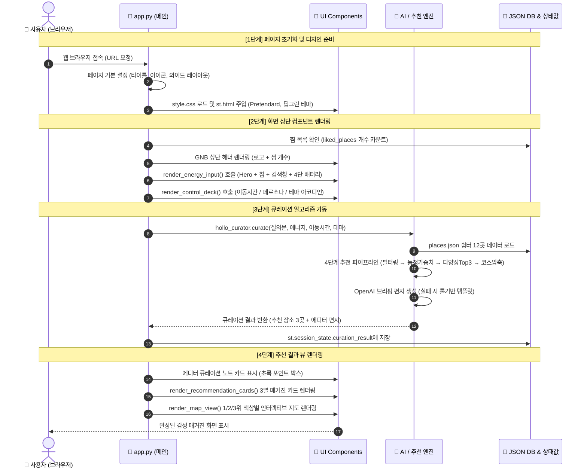
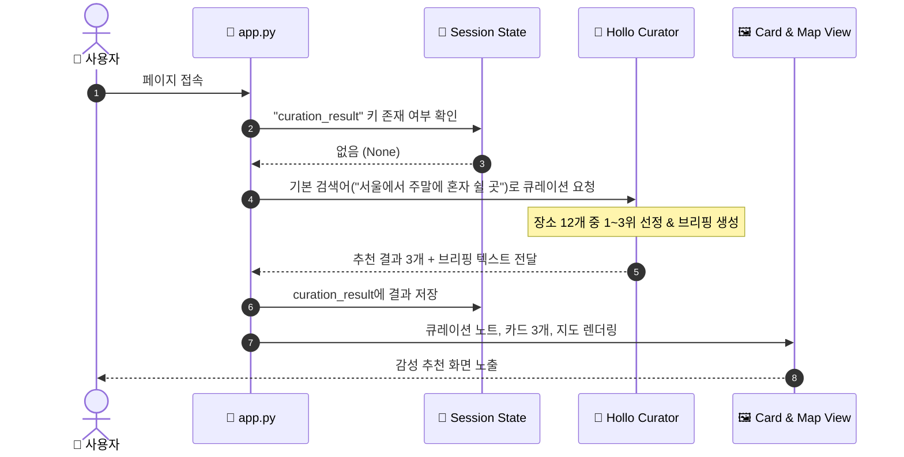
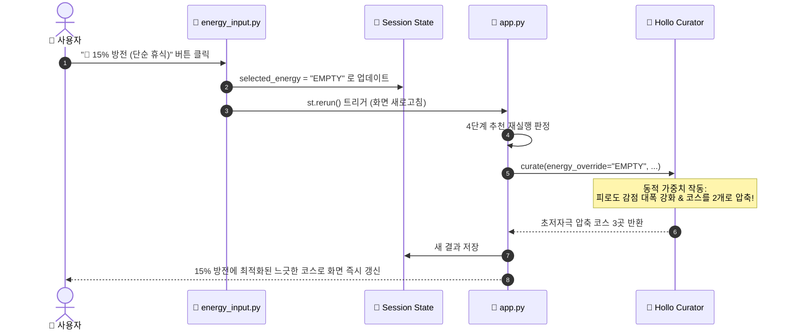
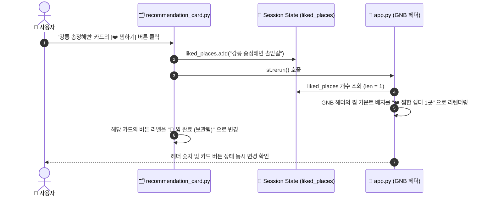

# 🌿 Hollo [홀로] - `app.py` 화면 & 기능 통합 명세서 (With Sequence Diagrams)

> **대상 독자:** 초보 개발자, UI/UX 디자이너, 기획자  
> **핵심 목표:** `app.py`를 중심으로 한 화면 렌더링 순서, 사용자 인터랙션, 백엔드/AI 로직 연동 구조를 한눈에 파악하기

---

## 📌 목차
1. [서비스 개요 및 핵심 디자인 규칙](#1-서비스-개요-및-핵심-디자인-규칙)
2. [전체 시스템 아키텍처 흐름도 (메인 시퀀스)](#2-전체-시스템-아키텍처-흐름도-메인-시퀀스)
3. [`app.py` 10대 섹션별 기능 & 디자인 상세 명세표](#3-apppy-10대-섹션별-기능--디자인-상세-명세표)
4. [사용자 주요 인터랙션별 세부 시퀀스 다이어그램](#4-사용자-주요-인터랙션별-세부-시퀀스-다이어그램)
   - [시나리오 A: 첫 페이지 접속 및 자동 큐레이션](#시나리오-a-첫-페이지-접속-및-자동-큐레이션)
   - [시나리오 B: 배터리(에너지) / 감성 칩 클릭 인터랙션](#시나리오-b-배터리에너지--감성-칩-클릭-인터랙션)
   - [시나리오 C: 찜하기(❤️) 클릭 및 상단 GNB 실시간 카운트 동기화](#시나리오-c-찜하기-클릭-및-상단-gnb-실시간-카운트-동기화)
5. [데이터 흐름 & 상태 관리 (Session State) 명세](#5-데이터-흐름--상태-관리-session-state-명세)
6. [초보 개발자 & 디자이너를 위한 협업 꿀팁 & 주의사항](#6-초보-개발자--디자이너를-위한-협업-꿀팁--주의사항)

---

## 1. 서비스 개요 및 핵심 디자인 규칙

- **서비스 컨셉:** 1집구석(1hows.com) 감성의 **1인 뚜벅이 저자극 힐링 여행 & 쉼터 큐레이터**
- **디자인 톤앤매너:**
  - 🎨 **메인 컬러:** 딥 그린 (`#056608`) — 숲과 안정감을 주는 시그니처 컬러
  - 🌿 **서브 컬러:** 세이지 틴트 (`#eaf5ea`) — 배지 및 활성 칩 배경
  - 📄 **배경:** 클린 오프화이트 (`#fafbfa`) & 순백색 카드 (`#ffffff`)
  - 🖋️ **텍스트:** 고대비 젯 블랙 (`#111111`) & 딥 차콜 (`#2b2b2b`) (Pretendard 폰트)
  - 🔘 **UI 폼:** 모서리가 둥근 캡슐형 알약(Pill Button)과 섬세한 테두리(`1.5px solid #dfe6df`)

---

## 2. 전체 시스템 아키텍처 흐름도 (메인 시퀀스)

초보자도 이해하기 쉬운 5단계 계층 구조입니다.
1. **User (방문자)**: 브라우저에서 화면을 보고 클릭
2. **app.py (지휘자/오케스트레이터)**: 전체 화면 배치 및 순서 제어
3. **UI Components (화면 부품)**: 헤더, 배터리, 필터, 카드, 지도
4. **Core AI / Logic (두뇌)**: 질문 분석, 장소 필터링, AI 감성 편지 생성
5. **Database & State (기억소)**: 쉼터 데이터(`places.json`)와 찜 목록(`session_state`)

---

## 3. `app.py` 10대 섹션별 기능 & 디자인 상세 명세표

| 순서 | 섹션명 | 담당 파일 | 초보 개발자를 위한 작동 원리 | 디자이너를 위한 UI/스타일 가이드 |
| :---: | :--- | :--- | :--- | :--- |
| **1** | **페이지 설정** | `app.py` (L29~35) | `st.set_page_config()`로 브라우저 탭 이름, 파비콘, 와이드(`wide`) 너비를 정의합니다. | PC 화면 폭을 넓게 쓰며, 사이드바는 접힘(`collapsed`) 상태로 시작합니다. |
| **2** | **글로벌 CSS 로드** | `ui/style.css` (L37~43) | `st.html()`을 이용해 CSS를 안전하게 주입합니다. 마크다운 기호 깨짐을 완벽 방지합니다. | 전역 Pretendard 폰트, 오프화이트 배경(`rgba(250,251,250)`), 텍스트 고대비 적용 |
| **3** | **GNB 상단 헤더** | `app.py` (L44~69) | `st.session_state.liked_places`의 길이를 세어 우측 상단 찜 카운트에 실시간 반영합니다. | 로고 + "혼자일 때 더 좋은 것들" 연두 뱃지 + 우측 "❤️ 찜한 쉼터 N곳" 알약 버튼 |
| **4** | **Hero & 배터리 입력** | `ui/energy_input.py` (L71~72) | - 5개 상황 칩 버튼 - 대화형 검색 인풋 - 4단계 방전~충전 배터리 라디오 버튼 | 중앙 정렬 큰 제목("오늘, 혼자 뭐하지?"), 선택된 칩/버튼은 딥 그린(#056608) 채움 배경 |
| **5** | **상세 컨트롤 덱** | `ui/control_deck.py` (L74~75) | `st.expander` 아코디언 안에 세부 이동시간 슬라이더, 페르소나, 테마 선택 셀렉트박스를 배치합니다. | 기본은 접힘 상태. 펼치면 깔끔한 3분할 화이트 박스로 노출되며 글씨 겹침 없는 커스텀 화살표 적용 |
| **6** | **세션 및 큐레이션 실행** | `core/curator.py` (L77~92) | '맞춤 큐레이션' 버튼 클릭 또는 최초 로드 시 AI 큐레이터가 동작하여 `session_state`에 결과를 보관합니다. | 연두색 스피너(`st.spinner`) "🌿 오늘의 기분과 에너지에 맞는 나만의 쉼표를 고르고 있습니다..." |
| **7** | **에디터 큐레이션 노트** | `app.py` (L94~107) | LLM이 생성한 따뜻한 추천 이유를 브리핑 카드로 감싸 렌더링합니다. | 좌측 5px 딥 그린 테두리, 부드러운 박스 섀도우, 말풍선(💬) 타이틀 |
| **8** | **매거진 카드 3열 그리드** | `ui/recommendation_card.py` (L109~112) | 추천된 Top 3 장소를 `st.columns(3)`으로 쪼개어 각각 16:10 고화질 이미지, 태그, 일정, 찜 버튼으로 노출합니다. | 호버 시 살짝 떠오르는 카드 효과, 순위 뱃지(1위 딥그린, 2위 에메랄드, 3위 앰버), 자극도 칩 |
| **9** | **미니멀 라이트 지도** | `ui/map_view.py` (L115~117) | Pydeck 지도 라이브러리를 통해 3곳의 위경도 좌표에 1, 2, 3위 색상별 핀을 꽂고 툴팁을 제공합니다. | 카토 라이트(Carto Light) 베이스의 군더더기 없는 미니멀 지도 뷰 |
| **10**| **개발자 디버그 모드** | `app.py` (L119~128) | 컨트롤 덱에서 '🛠️ 디버그 정보' 체크 시 AI가 추출한 슬롯 파라미터 JSON을 화면 하단에 투명하게 공개합니다. | 초보 개발자가 백엔드 데이터(질의문, 가중치, 선택된 테마)를 점검하는 용도 |

---

## 4. 사용자 주요 인터랙션별 세부 시퀀스 다이어그램

### 시나리오 A: 첫 페이지 접속 및 자동 큐레이션
사용자가 처음 들어왔을 때 빈 화면이 뜨지 않고 바로 추천 결과가 채워지는 과정입니다.

---

### 시나리오 B: 배터리(에너지) / 감성 칩 클릭 인터랙션
사용자가 기분 칩(예: 🌊 바다멍)이나 배터리 상태(🪫 15% 방전)를 바꿨을 때의 반응 순서입니다.

---

### 시나리오 C: 찜하기(❤️) 클릭 및 상단 GNB 실시간 카운트 동기화
사용자가 마음에 드는 장소 카드의 "❤️ 찜하기" 버튼을 눌렀을 때 상단 네비게이션 바까지 연결되는 구조입니다.

---

## 5. 데이터 흐름 & 상태 관리 (Session State) 명세

Streamlit은 사용자가 버튼을 누르면 코드가 위에서부터 아래로 다시 실행됩니다. 이때 **지워지지 않고 유지되는 데이터 저장소**가 바로 `st.session_state`입니다.

| 키 이름 (`Key`) | 데이터 타입 | 기본값 | 사용 목적 및 역할 |
| :--- | :---: | :--- | :--- |
| `st.session_state.liked_places` | `set()` | `set()` | 사용자가 찜한 장소들의 고유 이름 목록 (중복 자동 제거) |
| `st.session_state.selected_mood_chip` | `str` | `"ALL"` | 현재 선택된 감성 캡슐 칩 ID (`ALL`, `SEA`, `FOREST`, `BOOK`, `REST`) |
| `st.session_state.selected_energy` | `str` | `"LOW"` | 현재 사용자의 에너지 배터리 레벨 (`EMPTY`, `LOW`, `MEDIUM`, `HIGH`) |
| `st.session_state.current_query` | `str` | `"서울에서 이번 주말..."` | 검색창에 표시 및 입력된 사용자 자연어 질문 문자열 |
| `st.session_state.curation_result` | `dict` | `None` | AI 큐레이터가 계산해낸 추천 3곳과 에디터 브리핑 본문 딕셔너리 |

---

## 6. 초보 개발자 & 디자이너를 위한 협업 꿀팁 & 주의사항

### 💡 디자이너를 위한 Tip
1. **CSS 수정 위치:** 모든 디자인 색상, 여백, 버튼 둥글기, 그림자는 `hollo_test/ui/style.css` 한 파일에 모여 있습니다.
2. **글씨 겹침 주의:** Streamlit 내장 아이콘(화살표, 톱니바퀴 등)은 `Material Symbols` 웹폰트를 씁니다. CSS에서 와일드카드 `* { font-family: Pretendard !important; }`를 주면 아이콘이 영문 글씨(`keyboard_arrow_right`)로 변형되어 겹치는 오류가 생기므로 아이콘 클래스는 제외해야 합니다.
3. **이미지 비율(Aspect Ratio):** 카드 내 이미지는 `aspect-ratio: 16 / 10; object-fit: cover;`로 고정되어 있어 원본 사진이 찌그러지지 않고 균일하게 카드형으로 렌더링됩니다.

### 💡 초보 개발자를 위한 Tip
1. **HTML 주입 규칙:** Streamlit에서 HTML/CSS를 화면에 넣을 때 `st.markdown(unsafe_allow_html=True)` 대신 반드시 **`st.html()`**을 사용하세요. 들여쓰기 4칸이 코드 블록으로 오인되는 버그를 원천 차단해 줍니다.
2. **페이지 재실행 원리:** 사용자가 라디오, 셀렉트박스, 버튼을 건드릴 때마다 `app.py` 1번 줄부터 129번 줄까지 순차적으로 다시 실행됩니다. 따라서 무거운 계산이나 AI 호출 결과는 반드시 `st.session_state`에 넣어두어 불필요한 반복 호출을 막아야 속도가 빠릅니다.
3. **디버그 모드 활용:** `control_deck` 아코디언을 열고 맨 아래 `🛠️ 디버그 정보 보기`를 체크하면, AI 파이프라인 내부 상태가 실시간 JSON 형태로 화면 하단에 출력되므로 에러 추적 시 매우 편리합니다.
