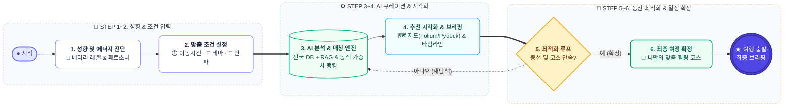

```mermaid
%%{init: {
    'theme': 'base',
    'themeVariables': {
        'fontFamily': 'Pretendard, -apple-system, BlinkMacSystemFont, "Segoe UI", Roboto, "Noto Sans KR", sans-serif',
        'fontSize': '13px',
        'primaryColor': '#ffffff',
        'primaryBorderColor': '#6366f1',
        'primaryTextColor': '#1e293b',
        'lineColor': '#64748b',
        'edgeLabelBackground': '#ffffff',
        'tertiaryColor': '#f8fafc',
        'clusterBkg': '#ffffff',
        'clusterBorder': '#e2e8f0'
    }
}}%%

flowchart LR
    %% ==========================================
    %% 1단계 & 2단계: 사용자 맞춤 조건 수집
    %% ==========================================
    subgraph Col1 [" 📌 STEP 1~2. 성향 & 조건 입력 "]
        direction LR
        Start(["● 시작"])
        N1["<b>1. 성향 및 에너지 진단</b><br/>🪫 배터리 레벨 & 페르소나"]
        N2["<b>2. 맞춤 조건 설정</b><br/>⏱️ 이동시간 · 🌿 테마 · 👥 인파"]
        Start --> N1 --> N2
    end

    %% ==========================================
    %% 3단계 & 4단계: AI 분석 및 인터랙티브 시각화
    %% ==========================================
    subgraph Col2 [" ⚙️ STEP 3~4. AI 큐레이션 & 시각화 "]
        direction LR
        N3[("<b>3. AI 분석 & 매칭 엔진</b><br/>전국 DB + RAG & 동적 가중치 랭킹")]
        N4["<b>4. 추천 시각화 & 브리핑</b><br/>🗺️ 지도(Folium/Pydeck) & 타임라인"]
        N3 --> N4
    end

    %% ==========================================
    %% 5단계 & 6단계: 피드백 루프 및 최종 확정
    %% ==========================================
    subgraph Col3 [" 🧭 STEP 5~6. 동선 최적화 & 일정 확정 "]
        direction LR
        N5{"<b>5. 최적화 루프</b><br/>동선 및 코스 만족?"}
        N6["<b>6. 최종 여정 확정</b><br/>🌿 나만의 맞춤 힐링 코스"]
        End((("★ 여행 출발<br/>최종 브리핑")))

        N5 -. "아니오 (재탐색)" .-> N3
        N5 -- "예 (확정)" --> N6
        N6 --> End
    end

    %% ==========================================
    %% 단계 간 전환 흐름 (굵은 화살표)
    %% ==========================================
    N2 ==> N3
    N4 ==> N5

    %% ==========================================
    %% 클래스 스타일 정의
    %% ==========================================
    classDef default font-family:inherit;
    classDef startNode fill:#e0e7ff,stroke:#6366f1,stroke-width:2px,color:#312e81,rx:20px;
    classDef inputNode fill:#ffffff,stroke:#818cf8,stroke-width:1.5px,color:#1e293b,rx:10px;
    classDef aiNode fill:#f0fdf4,stroke:#10b981,stroke-width:2px,color:#064e3b,rx:8px;
    classDef vizNode fill:#f0fdfa,stroke:#06b6d4,stroke-width:1.5px,color:#134e4a,rx:10px;
    classDef decisionNode fill:#fef3c7,stroke:#f59e0b,stroke-width:2px,color:#78350f;
    classDef finishNode fill:#ecfdf5,stroke:#059669,stroke-width:2px,color:#065f46,rx:10px;
    classDef endNode fill:#4f46e5,stroke:#3730a3,stroke-width:3px,color:#ffffff,rx:30px;

    class Start startNode;
    class N1,N2 inputNode;
    class N3 aiNode;
    class N4 vizNode;
    class N5 decisionNode;
    class N6 finishNode;
    class End endNode;

    %% 서브그래프 박스 스타일 (카드형 글래스 느낌)
    style Col1 fill:#f8fafc,stroke:#cbd5e1,stroke-width:1.5px,stroke-dasharray: 4 4,rx:14px
    style Col2 fill:#f8fafc,stroke:#a7f3d0,stroke-width:1.5px,stroke-dasharray: 4 4,rx:14px
    style Col3 fill:#f8fafc,stroke:#fed7aa,stroke-width:1.5px,stroke-dasharray: 4 4,rx:14px
```