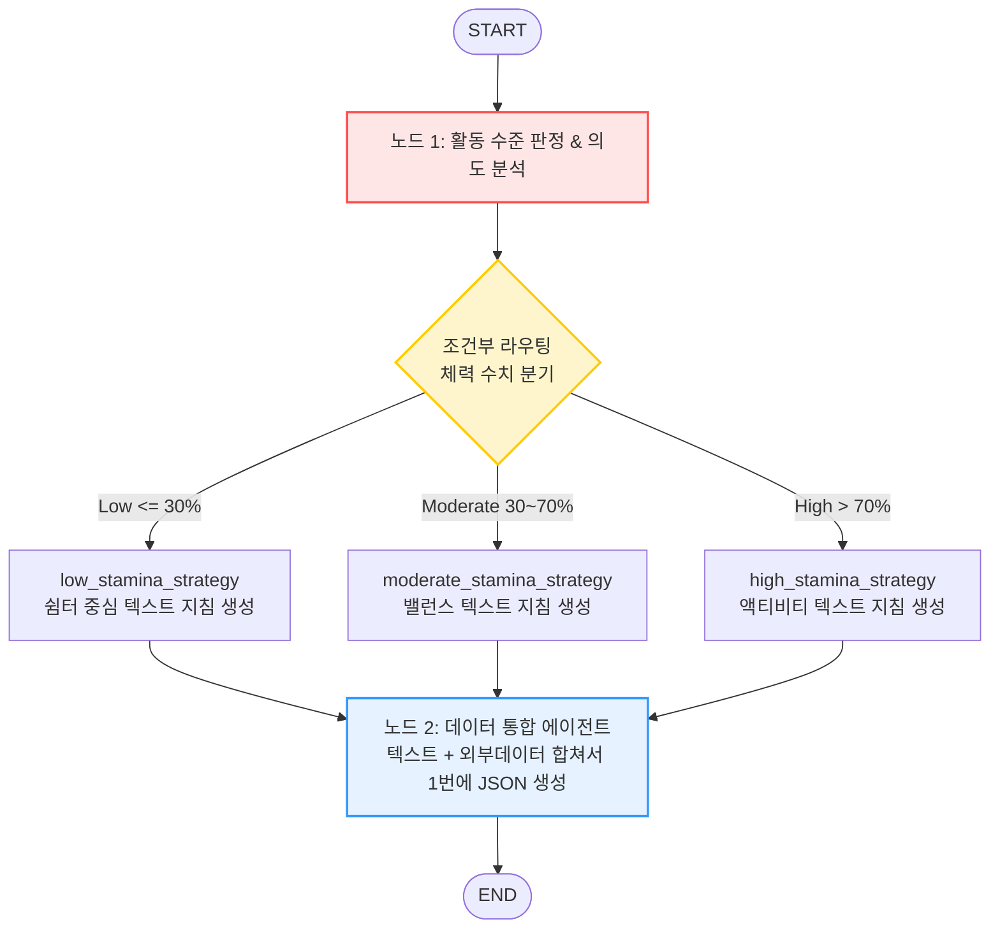

```mermaid
graph TD
    Start([START]) --> Node1[노드 1: 활동 수준 판정 & 의도 분석]
    
    Node1 --> Condition{조건부 라우팅<br/>체력 수치 분기}
    
    Condition -->|Low <= 30%| LowNode[low_stamina_strategy<br/>쉼터 중심 텍스트 지침 생성]
    Condition -->|Moderate 30~70%| ModNode[moderate_stamina_strategy<br/>밸런스 텍스트 지침 생성]
    Condition -->|High > 70%| HighNode[high_stamina_strategy<br/>액티비티 텍스트 지침 생성]
    
    LowNode --> Node2[노드 2: 데이터 통합 에이전트<br/>텍스트 + 외부데이터 합쳐서 1번에 JSON 생성]
    ModNode --> Node2
    HighNode --> Node2
    
    Node2 --> End([END])

    style Node1 fill:#ffe6e6,stroke:#ff4d4d,stroke-width:2px
    style Node2 fill:#e6f2ff,stroke:#3399ff,stroke-width:2px
    style Condition fill:#fff5cc,stroke:#ffcc00,stroke-width:2px
```