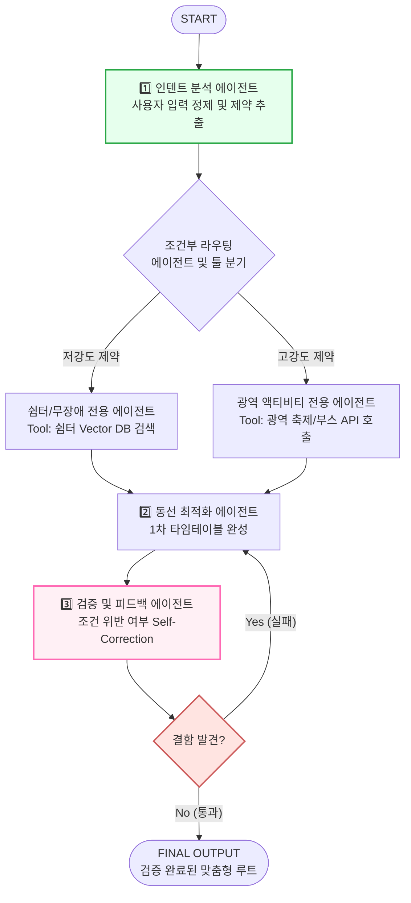

```mermaid
graph TD
    Start([START]) --> IntentAgent["1️⃣ 인텐트 분석 에이전트<br/>사용자 입력 정제 및 제약 추출"]
    
    IntentAgent --> Condition{"조건부 라우팅<br/>에이전트 및 툴 분기"}
    
    Condition -->|저강도 제약| RestAgent["쉼터/무장애 전용 에이전트<br/>Tool: 쉼터 Vector DB 검색"]
    Condition -->|고강도 제약| ActAgent["광역 액티비티 전용 에이전트<br/>Tool: 광역 축제/부스 API 호출"]
    
    RestAgent --> RouteAgent["2️⃣ 동선 최적화 에이전트<br/>1차 타임테이블 완성"]
    ActAgent --> RouteAgent
    
    RouteAgent --> CritiqueAgent["3️⃣ 검증 및 피드백 에이전트<br/>조건 위반 여부 Self-Correction"]
    
    CritiqueAgent --> Check{"결함 발견?"}
    Check -->|"Yes (실패)"| RouteAgent
    Check -->|"No (통과)"| Final(["FINAL OUTPUT<br/>검증 완료된 맞춤형 루트"])

    style IntentAgent fill:#e6ffed,stroke:#28a745,stroke-width:2px
    style CritiqueAgent fill:#fff0f5,stroke:#ff69b4,stroke-width:2px
    style Check fill:#ffe4e1,stroke:#cd5c5c,stroke-width:2px
```