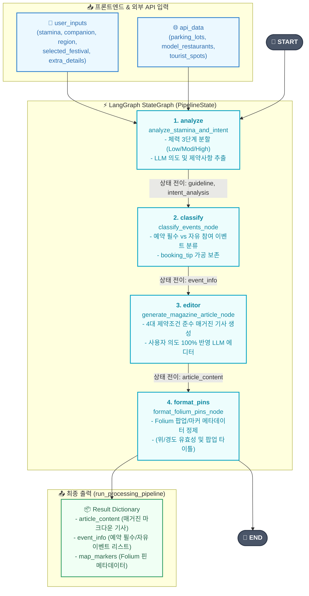
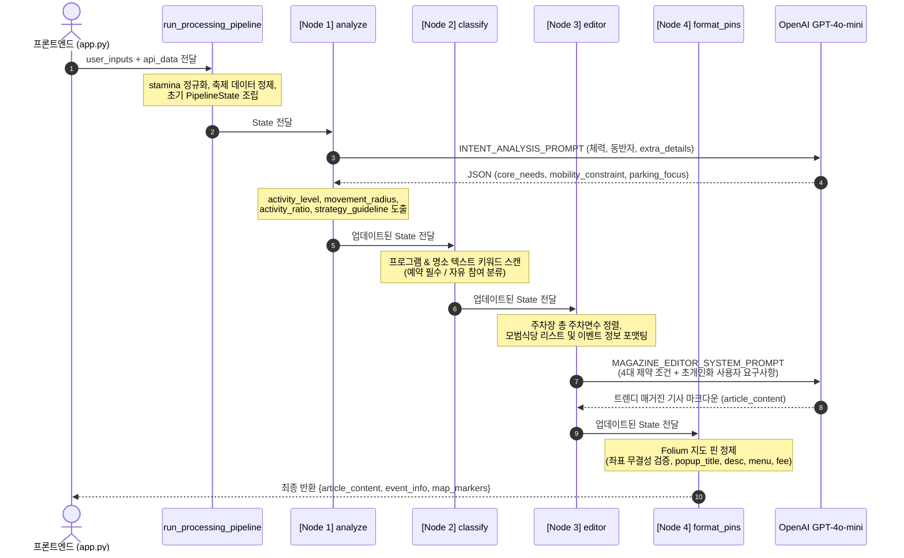
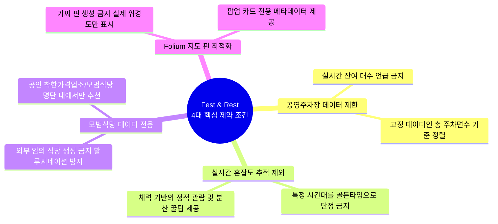

# 🎪 Fest & Rest AI 파이프라인 아키텍처 (LangGraph)

본 문서는 `agent.py`에 구현된 **초개인화 로컬 축제 & 쉼터 큐레이션 (Fest & Rest)** 백엔드 AI 파이프라인의 구조 및 데이터 흐름을 시각화한 Mermaid 다이어그램입니다.

---

## 1. 전체 파이프라인 워크플로우 (Pipeline Workflow)

---

## 2. 상태 전이 및 데이터 흐름 (State Transition & Data Flow)

---

## 3. 핵심 4대 제약 조건 반영 구조

