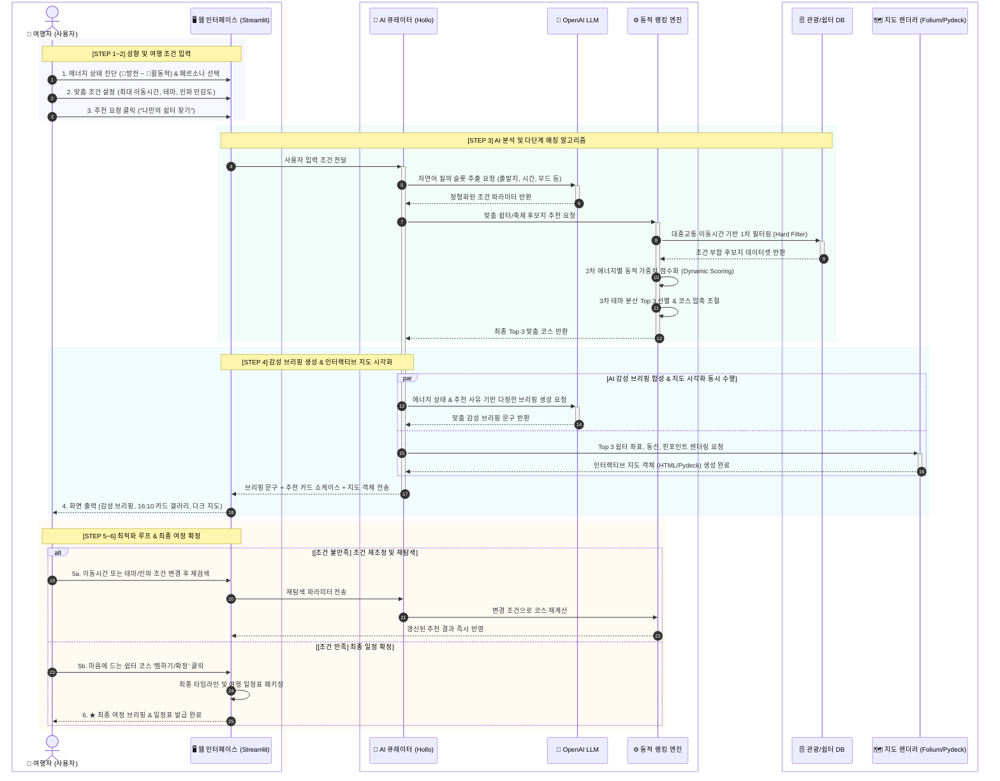

```mermaid
%%{init: {
    'theme': 'base',
    'themeVariables': {
        'fontFamily': 'Pretendard, -apple-system, BlinkMacSystemFont, "Segoe UI", Roboto, "Noto Sans KR", sans-serif',
        'fontSize': '13px',
        'primaryColor': '#ffffff',
        'primaryBorderColor': '#6366f1',
        'primaryTextColor': '#1e293b',
        'lineColor': '#64748b',
        'actorBkg': '#f8fafc',
        'actorBorder': '#6366f1',
        'actorTextColor': '#1e293b',
        'actorLineColor': '#cbd5e1',
        'signalColor': '#475569',
        'signalTextColor': '#1e293b',
        'labelBoxBkgColor': '#ffffff',
        'labelBoxBorderColor': '#e2e8f0',
        'labelTextColor': '#1e293b',
        'noteBkgColor': '#f5f3ff',
        'noteBorderColor': '#818cf8',
        'noteTextColor': '#312e81',
        'activationBkgColor': '#e0e7ff',
        'activationBorderColor': '#6366f1',
        'sequenceNumberColor': '#ffffff'
    }
}}%%

sequenceDiagram
    autonumber

    box #f8fafc 사용자 인터페이스
        actor User as 👤 여행자 (사용자)
        participant UI as 🖥️ 웹 인터페이스 (Streamlit)
    end

    box #f0fdf4 AI & 추천 코어
        participant App as 🧠 AI 큐레이터 (Hollo)
        participant LLM as 🤖 OpenAI LLM
        participant Rec as ⚙️ 동적 랭킹 엔진
    end

    box #f0fdfa 데이터 & 시각화
        participant DB as 🗄️ 관광/쉼터 DB
        participant Map as 🗺️ 지도 렌더러 (Folium/Pydeck)
    end

    %% ========================================================
    %% STEP 1~2: 성향 & 조건 입력
    %% ========================================================
    rect rgba(99, 102, 241, 0.05)
        Note over User, UI: [STEP 1~2] 성향 및 여행 조건 입력
        User->>UI: 1. 에너지 상태 진단 (🪫방전 ~ 🔋활동적) & 페르소나 선택
        User->>UI: 2. 맞춤 조건 설정 (최대 이동시간, 테마, 인파 민감도)
        User->>UI: 3. 추천 요청 클릭 ("나만의 쉼터 찾기")
    end

    %% ========================================================
    %% STEP 3: AI 분석 및 매칭 엔진
    %% ========================================================
    rect rgba(16, 185, 129, 0.05)
        Note over UI, DB: [STEP 3] AI 분석 및 다단계 매칭 알고리즘
        UI->>+App: 사용자 입력 조건 전달
        App->>+LLM: 자연어 질의 슬롯 추출 요청 (출발지, 시간, 무드 등)
        LLM-->>-App: 정형화된 조건 파라미터 반환
        
        App->>+Rec: 맞춤 쉼터/축제 후보지 추천 요청
        Rec->>+DB: 대중교통 이동시간 기반 1차 필터링 (Hard Filter)
        DB-->>-Rec: 조건 부합 후보지 데이터셋 반환
        Rec->>Rec: 2차 에너지별 동적 가중치 점수화 (Dynamic Scoring)
        Rec->>Rec: 3차 테마 분산 Top 3 선별 & 코스 압축 조절
        Rec-->>-App: 최종 Top 3 맞춤 코스 반환
    end

    %% ========================================================
    %% STEP 4: 추천 시각화 & 감성 브리핑
    %% ========================================================
    rect rgba(6, 182, 212, 0.05)
        Note over App, UI: [STEP 4] 감성 브리핑 생성 & 인터랙티브 지도 시각화
        par AI 감성 브리핑 합성 & 지도 시각화 동시 수행
            App->>+LLM: 에너지 상태 & 추천 사유 기반 다정한 브리핑 생성 요청
            LLM-->>-App: 맞춤 감성 브리핑 문구 반환
        and
            App->>+Map: Top 3 쉼터 좌표, 동선, 핀포인트 렌더링 요청
            Map-->>-App: 인터랙티브 지도 객체 (HTML/Pydeck) 생성 완료
        end

        App-->>-UI: 브리핑 문구 + 추천 카드 쇼케이스 + 지도 객체 전송
        UI-->>User: 4. 화면 출력 (감성 브리핑, 16:10 카드 갤러리, 다크 지도)
    end

    %% ========================================================
    %% STEP 5~6: 동선 최적화 루프 및 최종 확정
    %% ========================================================
    rect rgba(245, 158, 11, 0.05)
        Note over User, UI: [STEP 5~6] 최적화 루프 & 최종 여정 확정
        alt [조건 불만족] 조건 재조정 및 재탐색
            User->>UI: 5a. 이동시간 또는 테마/인파 조건 변경 후 재검색
            UI->>App: 재탐색 파라미터 전송
            App->>Rec: 변경 조건으로 코스 재계산
            Rec-->>UI: 갱신된 추천 결과 즉시 반영
        else [조건 만족] 최종 일정 확정
            User->>UI: 5b. 마음에 드는 쉼터 코스 '찜하기/확정' 클릭
            UI->>UI: 최종 타임라인 및 여행 일정표 패키징
            UI-->>User: 6. ★ 최종 여정 브리핑 & 일정표 발급 완료
        end
    end
```
